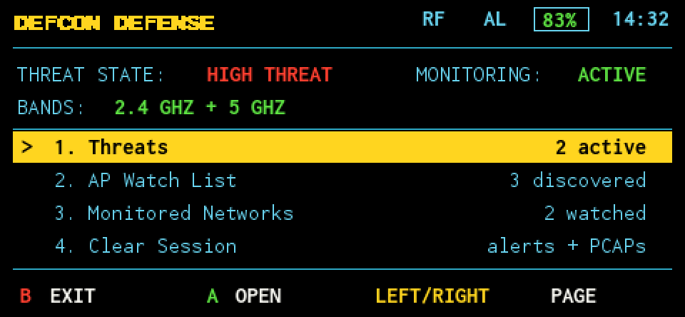
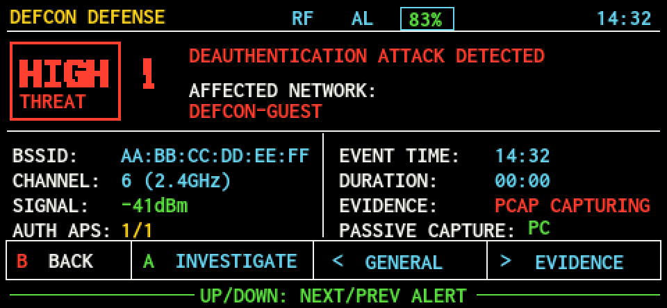
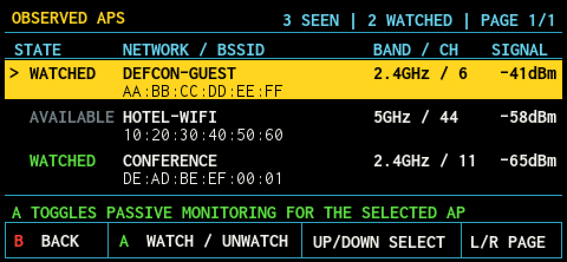
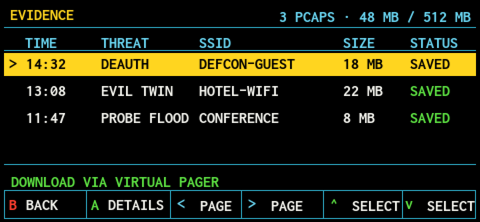
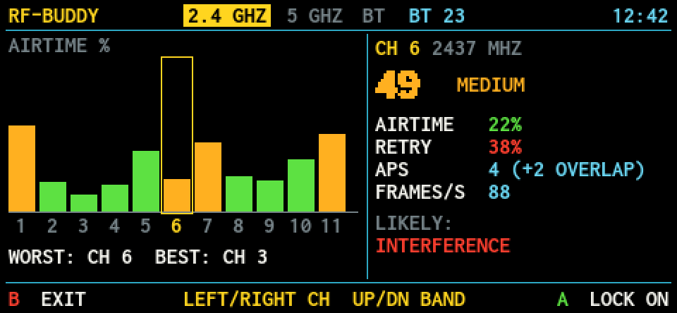
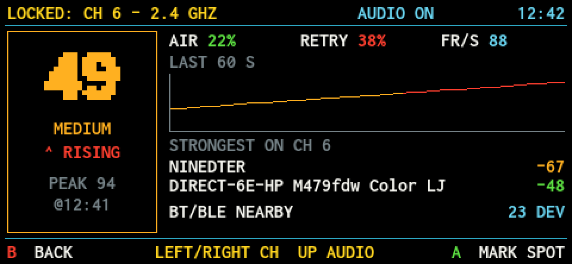
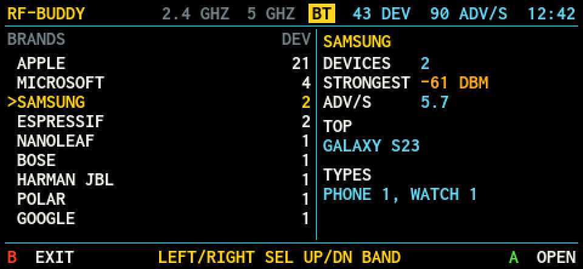
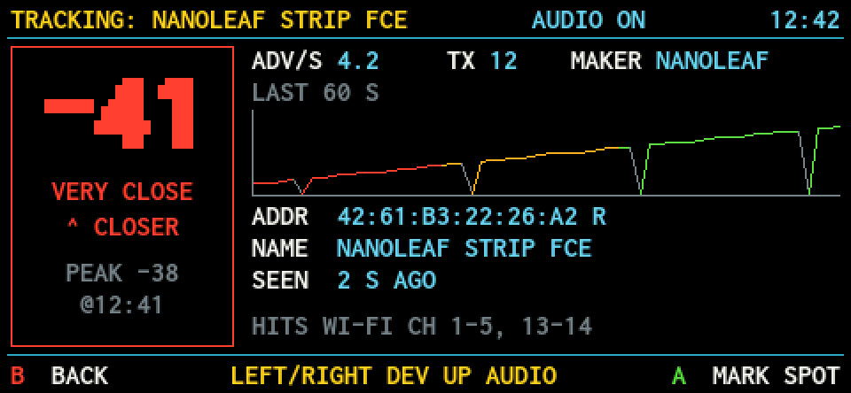

# DEFCON-DEFENSE

Defensive, passive RF tooling for conference season and the office: early
warning when someone is attacking the Wi-Fi around you, and a walk-around
finder for 2.4 / 5 GHz and Bluetooth interference. Nothing here transmits
attacks against other people.

## Projects

| Folder | Device | What it is |
|---|---|---|
| [`pineapple-pager/`](pineapple-pager/README.md) | Hak5 WiFi Pineapple Pager | Payloads for the Pager, installed into their own **defcon** folder in the Payloads menu |
| [`flipper-zero/`](flipper-zero/README.md) | Flipper Zero + ESP32-S2 Marauder board | A single defensive monitoring app for 2.4 GHz |

### Pager payloads

- **DEFCON Defense** (`user/defcon/DEFCON-DEFENSE`): a full-screen passive
  monitor. It correlates live Recon against your trusted and watched networks,
  alerts on mismatches, and makes bounded PCAP evidence captures with SHA-256
  verification. It mirrors its screen to the Virtual Pager.
- **RF-BUDDY** (`user/defcon/RF-BUDDY`): an office interference finder.
  - Channel overview that scores airtime, retries, overlap and Bluetooth density.
  - One-second lock-on meter with a buzzer tick.
  - Bluetooth LE browser that goes from brand to type to device, with a TRACK
    proximity meter.
  - Survey log, with numbered MARK SPOT markers.
- **Alert hooks:** `defcon_sentry` warns on a repeated deauth flood.
  `defcon_honeypot` warns when a client joins your own decoy AP.

The two full-screen payloads are fully independent. They use separate folders,
ports, logs and deploys.

## Screenshots

These are the Pager's native 480 × 222 screens, shown at 2× and rendered from
each UI's built-in preview data (`-preview-dir`), not from a live capture.

### DEFCON Defense

| | |
|---|---|
|  |  |
| **Home.** The overall threat state, which bands are monitored, and the main menu. | **Threat detail.** A deauth attack on a watched network. A bounded PCAP capture starts automatically. |
|  |  |
| **Observed APs.** Choose which nearby networks to watch, straight from live Recon. | **Evidence.** Saved PCAPs with SHA-256 verification. You download them through the Virtual Pager. |

### RF-BUDDY

| | |
|---|---|
|  |  |
| **Channel overview.** Each channel is scored on airtime, retries, AP overlap and Bluetooth density, with the worst and best channel called out. | **Lock-on meter.** One channel, updated every second, with a buzzer tick and the strongest transmitters. Walk around to find the source. |
|  |  |
| **Bluetooth browser.** Nearby BLE devices grouped by brand, then type, then individual device. | **TRACK.** A proximity meter for one Bluetooth device, so you can walk right up to it. |

## Quick start (Pager)

Requirements on your computer:
- Go 1.21 or newer. Dependencies are vendored, so the build works offline.
- bash.
- [ripgrep](https://github.com/BurntSushi/ripgrep) (`rg`), used by the test suite.
- SSH key access to the Pager over USB (`root@172.16.52.1`).

```bash
cd pineapple-pager
./build.sh                          # cross-compiles the MIPS UIs into library/
bash tests/run_tests.sh             # full test suite
./deploy.sh --payload all           # install DEFCON Defense and RF-BUDDY
```

Then on the Pager, open **Payloads → defcon**. For the full install guide,
tuning and log locations, see [`pineapple-pager/README.md`](pineapple-pager/README.md).
Each payload has its own README:
- [DEFCON Defense](pineapple-pager/src/user/defcon/DEFCON-DEFENSE/README.md)
- [RF-BUDDY](pineapple-pager/src/user/defcon/RF-BUDDY/README.md)

## Repository layout

```
pineapple-pager/
  src/user/defcon/DEFCON-DEFENSE/   payload.sh + Go full-screen UI (ui/)
  src/user/defcon/RF-BUDDY/         payload.sh + Go full-screen UI (ui/)
  src/deauth_flood_detected/        defcon_sentry alert hook
  src/pineapple_client_connected/   defcon_honeypot alert hook
  lib/                              shared shell libraries
  vendor/pager-payloads/            pinned stock Hak5 payloads bundled in the build
  tests/                            shell + Go test suite (run_tests.sh)
  docs/                             design specs, plans, audits, performance notes
  build.sh / package.sh / deploy.sh
flipper-zero/                       Flipper Zero app (see its README)
```

`library/` and `dist/` are build output and are not committed.

## Safety and legal use

These tools passively observe RF you can already hear, plus your own device's
inbound traffic and your own decoy AP. Do not impersonate real networks. Use
Hak5 and Flipper hardware only for authorized auditing and security analysis.
You are responsible for following local law and venue rules. The tools are your
radar, not your armor: keep using a VPN and MAC randomization, and turn radios
off when you're not using them.

This project is licensed under GPL-3.0 (see [`LICENSE`](LICENSE)). The Flipper
Zero app carries its own copy in `flipper-zero/LICENSE`. Vendored third-party
code keeps its own license files.
