# Pager Text Containment Audit

Date: 2026-08-10  
Target: DEFCON Defense v4.3 on the connected WiFi Pineapple Pager  
Canvas: 480 × 222 pixels

## Verdict

Pass. No tested text or status icon crosses its assigned panel, divider,
neighboring field, footer, or screen edge. The audit covers the live flow,
empty states, active states, and deliberately overlong data.

## Reported defects and corrections

1. **CLEAR badge:** the five-letter title previously used an unconstrained 2×
   cell width. It now keeps the same height and prominence while fitting and
   clipping to the badge's inner rectangle.
2. **PASSIVE CAPTURE status icon:** the icon previously began before the label
   ended. Its position is now calculated from the rendered label width plus an
   eight-pixel gap.
3. **Evidence footer:** `DETAILS` and the last `SELECT` could touch their panel
   borders. Both labels now have explicit panel bounds and safe padding.
4. **Dynamic fields:** monitoring state, evidence totals, file sizes, evidence
   statuses, battery value, right-column metrics, and right-aligned counts now
   truncate with an ellipsis and clip to their allocated rectangles.

## Audited steps

1. **General monitor — healthy.** Header, monitoring state, selected row,
   counts, and footer controls remain separated.

   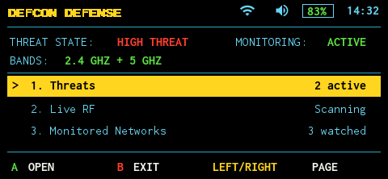

2. **Active Threat Details — healthy.** Severity badge, alert headline,
   affected network, both metric columns, capture label/icon, controls, and
   next/previous footer remain contained.

   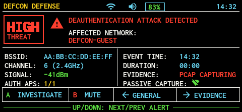

3. **Clear Threat Details — healthy.** `CLEAR` is fully inside the badge, and
   the PASSIVE CAPTURE icon has a visible gap after the label.

   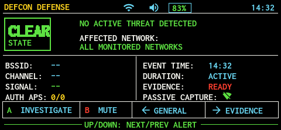

4. **Evidence list — healthy.** All table columns and six footer control groups
   remain inside their assigned widths.

   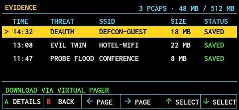

5. **Empty Evidence — healthy.** Empty-state title and explanation remain
   centered without touching columns or controls.

   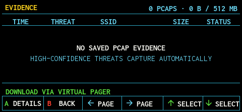

6. **Evidence detail — healthy.** Long hash, filename-derived metadata, and the
   download footer remain inside the canvas.

   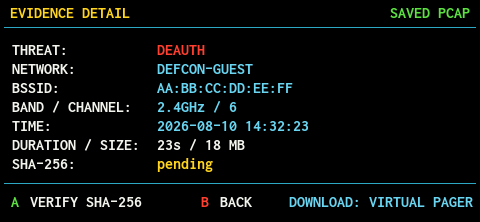

7. **Worst-case content — healthy.** Overlong monitor states, event names,
   SSIDs, sizes, evidence statuses, detail values, and toast messages truncate
   cleanly without overwriting a divider.

   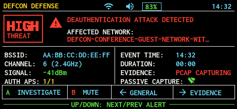
   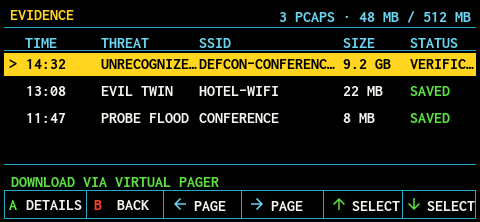
   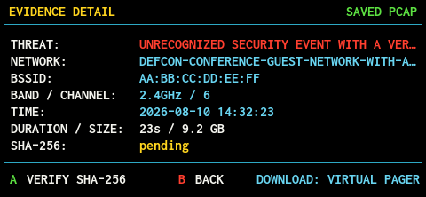
   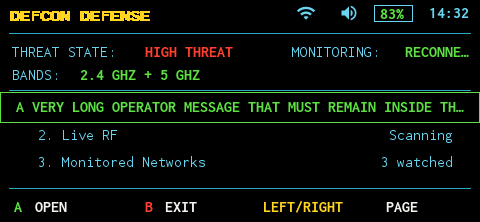

8. **Live Virtual Pager navigation — healthy.** General → Threat Details →
   Evidence → Evidence Detail was exercised with the connected Pager and real
   saved-PCAP data.

   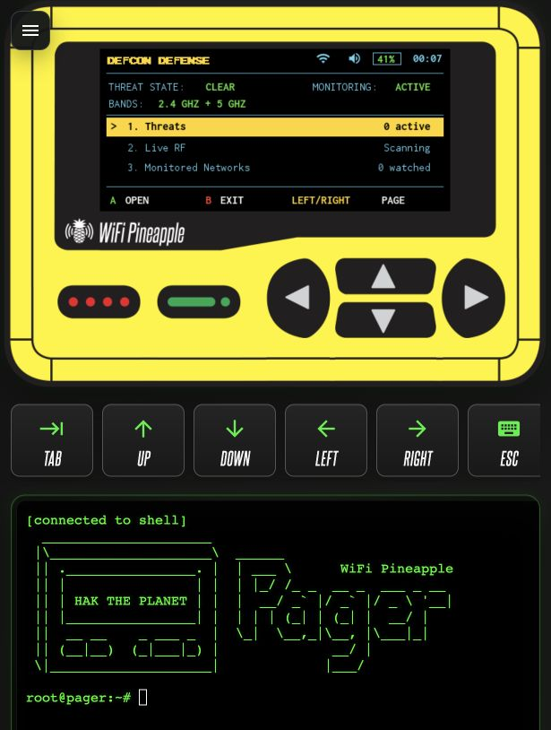
   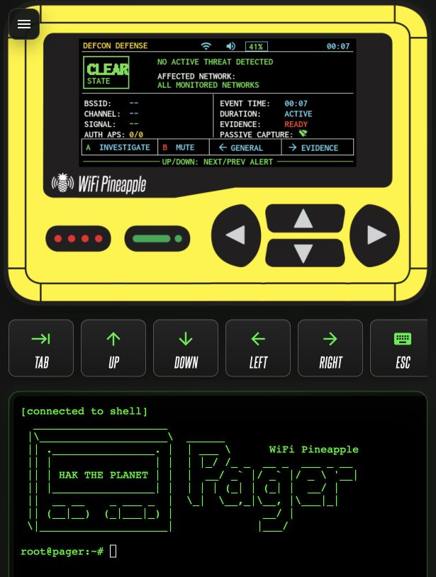
   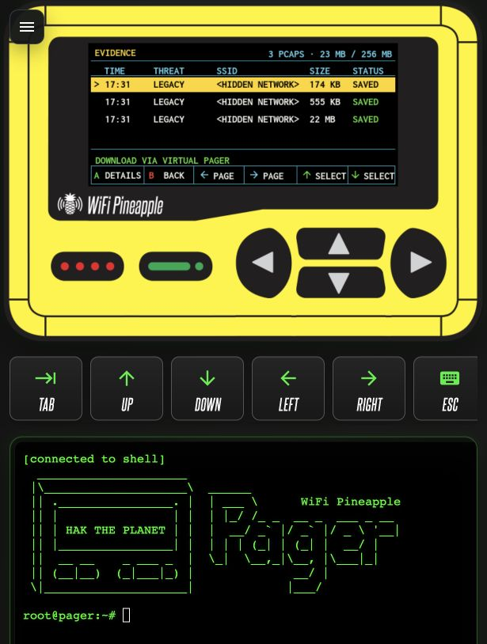
   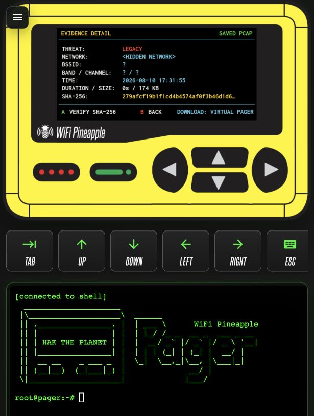

## Automated safeguards

- Preview generation covers eleven layout states using the device's real font
  and icon assets.
- Tests fail if CLEAR escapes its badge gutter, if the capture icon loses its
  reserved gap, or if text overwrites Threat/Evidence panel borders.
- Long dynamic values are bounded at the drawing layer, so unexpected device
  data cannot draw outside the specified text rectangle.
- A post-fix live regression sample with Virtual Pager open measured 0.30% idle
  CPU over 10 seconds, one UI process, stable 11.8 MB resident memory, and no
  active capture process.

## Accessibility observations and limits

Severity and state use both words and color, preserving meaning without relying
on color alone. Text contrast is visibly strong on the black canvas. This is a
visual containment audit of a fixed-resolution hardware interface; it does not
claim full WCAG compliance or test assistive technology, display calibration,
or every possible physical viewing condition.
